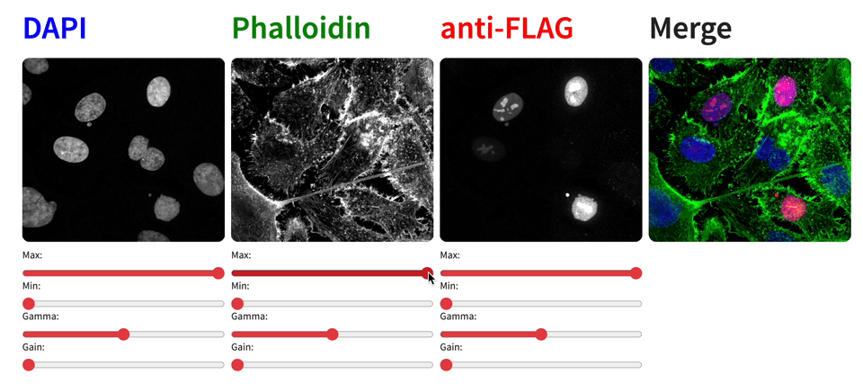

# Micrograph Extension For Quarto

Quarto shortcode extension to display micrographs in revealjs presentations



### Features not implemented but on the wish list

In descending order of priority:

- Support for 16-bit raw tif. 
- Panel to change LUT configuration instead of default RGB:
    - 🔵🟢🟣 blue, green, magenta `BGM`.
    - 🔵🩵🔴 blue, cyan, red `BCR`.
    - 🔵🟡🔴 blue, yellow, red `BYR`.
- Re-arrange channel order.
- Hide control panels and make them appear on a click.
- Change layout and size of individual panels.
- Support for video files.

## Installing quarto

Go to this site to install Quarto CLI, VScode recommend as IDE:
https://quarto.org/docs/get-started/

Also recommend the VScode Quarto extension:
https://quarto.org/docs/tools/vscode.html

## Installing the extension for your project

```bash
quarto add furthlab/micrograph
```

This will install the extension under the `_extensions` subdirectory.
If you're using version control, you will want to check in this directory.

## Using

The shortcode has the formula:
```

```

- First argument is path to file (e.g. `./img/GFP.jpg`).
- Second argument is name of the blue channel (default `DAPI`).
- Third argument is name of the green channel (default `Phalloidin`).
- Fourth argument is name of the red channel (default `anti-FLAG`).
- Optional arguments are:
    - `width = "255"` default is 255px. 

Full example:

```

```

## Example

Check our the source code for a minimal example using revealjs for the presentation: [example.qmd](example.qmd).

```
---
title: "Micrograph Example"
author: "John Doe"
format: revealjs
---

## Micrograph result



- **Primary antibody:** 1:1000 overnight
- **Secondary antibody:** 1:1000 for 1h
```